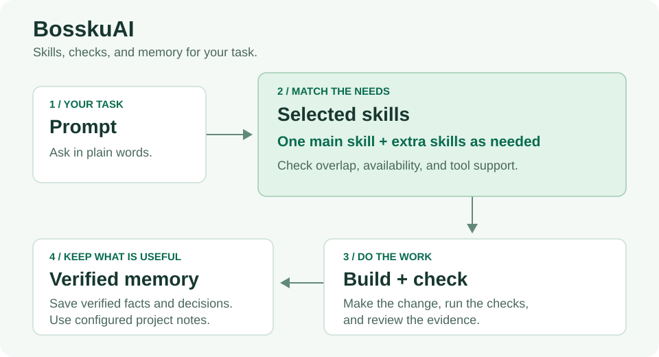

# BosskuAI

Give your coding agent the skills it needs for the job.

BosskuAI is an open-source skill library and CLI for **Cursor, Claude Code, Codex, OpenCode, and OMP**. Ask in plain words. The shared instructions guide your agent to choose a main skill, add useful skills for other parts of the request, check its work, and save verified project knowledge.



## How it works

1. Describe what you want. Say `bossku` or ask for cofounder mode in a project set up with BosskuAI.
2. Choose the skills for the task. Use one main skill and add others for needs such as mobile layout, keyboard access, or a separate marketing task. Avoid skills that do the same job, and check that your tools support them.
3. Make the change and check it. Plan when needed, run the relevant checks, and review the result before claiming success.
4. Save what is useful. Read project memory first; keep verified facts, decisions, plans, and lessons for the next session.

For example:

```text
bossku, build a signup page that works on phones and with a keyboard.
```

The [skill guide](docs/skills.md) explains selection. The [agent contracts](agents/) define planning, execution, review, and completion checks.

## Install and start

Requires **Python 3.11+** and **Git**. Replace the vault path below with an existing Obsidian vault.

```bash
git clone https://github.com/wankimmy/Bossku-AI bosskuAI
cd bosskuAI
pip install -e .
bossku install --profile full --vault "/path/to/your/Obsidian/Vault" --memory-storage obsidian
cd /path/to/your/project
bossku init .
bossku doctor --project .
```

Open that project in your coding agent, then say `bossku`.

Use `--profile core` for the smaller cofounder and loop-engineering set. Use `--profile full` for the full library. For shared or cloud workspaces, see [portable mode](docs/installation.md#portable-mode-cloudshared-repos).

Prefer a plugin? Follow the [Claude Code](docs/installation.md#claude-code), [Cursor](docs/installation.md#cursor), or [Codex](docs/installation.md#codex) instructions. [OpenCode](docs/installation.md#opencode) and [OMP](docs/installation.md#omp) use skills and project adapters.

Installation refreshes supported session hooks. Codex requires its normal one-time hook trust approval; direct memory writes do not depend on hooks. See the [memory guide](docs/memory.md).

## See why skills were selected

```bash
bossku skills find "Build a signup page with mobile layout and keyboard access"
bossku skills find "Review this code" --profile core
```

The result explains the main skill and any extra skills. It flags weak matches and shows what was left out and why. Some skills can only be started by the user. Read the selected descriptions before loading them; the ranked matches are suggestions to review.

## Keep project memory in one place

With `--memory-storage obsidian`, the vault is the source of truth for project notes and handoffs. Agents save useful, verified notes with `bossku remember` before replying. They skip secrets, raw prompts, transcripts, and duplicate notes.

```bash
bossku memory-path --project .
bossku remember --project . --kind decision "Use the existing test runner for this project."
```

If the vault is unavailable, BosskuAI reports the unsaved note and does not create repository memory as a fallback. Hooks check vault availability. Existing repository storage remains available for compatibility; changing the setting does not migrate or delete old notes. See [memory and Obsidian](docs/memory.md) for details.

## Update local skills

After pulling changes in your BosskuAI clone:

```bash
git pull
bossku update
bossku doctor
```

`bossku update` refreshes the installed skills and shared references from your local BosskuAI source. It preserves your selected install profile and unrelated skills.

## Checks you can run

```bash
python -m bossku validate --root .
python -m unittest discover -s tests -v
```

When skill descriptions or routing inputs change, rebuild the generated index first:

```bash
python -m bossku skills index --root .
```

## Measured routing checks

The [offline benchmark](docs/benchmarks/README.md) uses **82 existing regression prompts**. It checks the main skill chosen by the selector and whether user-only skills stay held for the user:

| Selection check | Recorded result |
|---|---:|
| Main skill chosen where automatic loading is allowed | 79/79 acceptable |
| User-only skill held for user invocation | 3/3 correctly deferred |

A separate search-ranking comparison uses the same prompts:

| Search method | Acceptable first match | Acceptable match in the first three |
|---|---:|---:|
| BosskuAI ranked search | 82/82 (100%) | 82/82 (100%) |
| Baseline using only skill names and descriptions | 46/82 (56.10%) | 61/82 (74.39%) |

These are prompts the router was tuned against, not an unseen test set. The results check the main skill and user-only deferral; they do not establish the quality of every extra skill or live host loading. Coding quality and token savings remain unmeasured. See the [saved results and inputs](docs/benchmarks/routing.json) for every case and the baseline method.

Reproduce the comparison:

```bash
python scripts/benchmark_routing.py
python scripts/benchmark_routing.py --check
```

## More commands

| Command | What it does |
|---|---|
| `bossku init <project>` | Add project instructions and initialize configured memory |
| `bossku init <project> --portable` | Include skills in the project |
| `bossku skills audit` | Check skill size, descriptions, and references |
| `bossku sync --project .` | Check vault storage or export legacy repository notes |
| `bossku doctor --project .` | Check installed skills and project adapters |

## Explore the library

- [Skills](skills/) cover engineering, product, design, security, marketing, and founder work.
- [Shared instructions](AGENTS.md) keep the workflow consistent across coding tools.
- [Third-party packs and credits](docs/third-party.md) list the vendored sources; [optional requirements](requirements-optional.txt) cover separate runtimes.
- [Claude Code practice review](docs/claude-practices-review.md) and [Archify practice review](docs/archify-practices-review.md) explain how their guidance was applied.
- [Product verification](skills/bosskuai-product-verification/SKILL.md) checks real user paths with observed evidence. [Hindsight memory](skills/bosskuai-hindsight-memory/SKILL.md) supports an approved, configured connection; its service remains optional and separate.

## License

[MIT](LICENSE).
