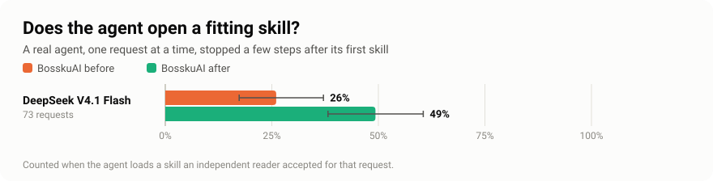

# BosskuAI

Skills for your coding agent, plus three habits that make its work better: find the right skill, run the code it writes, and remember your project.

Works with **Claude Code, Cursor, Codex, OpenCode, and OMP**. Free and open source ([MIT](LICENSE)).


## What you get

- **The right skill, found for you.** Say what you want in plain words. BosskuAI points your agent to the best skill, and adds a second one only when your request has two separate jobs.
- **Code that gets run.** If your agent changes code and never runs it, or pastes code into the chat instead of writing the file, it is sent back once. (Claude Code.)
- **A project that remembers.** Decisions and lessons are saved as short notes, in Obsidian if you use it. The newest ones appear when the next session starts.
- **Light on your agent's memory.** About 40 skills are listed each session. About 195 more are one command away.

For example:

```text
bossku, review this code for security problems.
```

## Does it help? We measured it with real agents

We ran a real coding agent (Claude Code) on small coding tasks with hidden tests, with and without BosskuAI. Three versions saw the same tasks: **without BosskuAI**, **before** (the previous release), and **after** (this release). Every number and chart below is rebuilt from result files saved in this repository, and a test fails if they ever disagree. How each check works, and what it cannot show, is in the [benchmark notes](docs/benchmarks/README.md).


<!-- results:start -->
| First call of a session | Without BosskuAI | Before | After |
|---|---:|---:|---:|
| Claude Haiku 4.5: input tokens | 32,280 | 34,706 | 33,613 |
| Claude Haiku 4.5: cost | $0.0108 | $0.0145 | $0.0120 |
| Claude Sonnet 5.5: input tokens | 33,856 | 43,539 | 36,770 |
| Claude Sonnet 5.5: cost | $0.0245 | $0.0600 | $0.0323 |

| Finding a skill (73 new requests) | Keyword search | Before | After |
|---|---:|---:|---:|
| Right skill ranked first | 60% | 59% | 74% |
| Right skill in the top three | 77% | 90% | 90% |
| Every part of a multi-part request covered | - | 40% | 56% |

| Hidden-test coding tasks | Without BosskuAI | Before | After |
|---|---:|---:|---:|
| DeepSeek V4.1 Flash: tasks passed (34 runs each) | 91% (31/34) | 97% (33/34) | 94% (32/34) |
| DeepSeek V4.1 Flash: tokens per run | 106k | 156k | 171k |
| DeepSeek V4.1 Flash: ended without running its code | 0% | 0% | 3% |
| Nemotron 3 Nano 30B: tasks passed (68 runs each) | 22% (15/68) | 21% (14/68) | 38% (26/68) |
| Nemotron 3 Nano 30B: tokens per run | 57k | 61k | 221k |
| Nemotron 3 Nano 30B: ended without running its code | 100% | 100% | 48% |

| HumanEval problems | Without BosskuAI | Before | After |
|---|---:|---:|---:|
| DeepSeek V4.1 Flash: tasks passed (40 runs each) | 98% (39/40) | 95% (38/40) | 100% (40/40) |
| DeepSeek V4.1 Flash: tokens per run | 74k | 120k | 86k |
| Nemotron 3 Nano 30B: tasks passed (40 runs each) | 80% (32/40) | 75% (30/40) | 78% (31/40) |
| Nemotron 3 Nano 30B: tokens per run | 85k | 83k | 208k |
<!-- results:end -->





### What the numbers say

- **A small model finishes more tasks.** Nemotron 3 Nano passed 22% of the hidden-test tasks on its own and 38% with this release (the previous release: 21%). On the same 17 tasks that is 16 points more, with a 95% interval of +6 to +27. On its own, every run that changed code ended without running anything. With BosskuAI about half still did, and the other half ran the code, fixed what failed, and passed more often.
- **A strong model gains nothing on these tasks.** DeepSeek V4.1 Flash already runs its own tests and passed 91% to 97% in every version, so there is no room to improve. BosskuAI makes it do about 1.6 times the work (tokens).
- **It finds the right skill more often.** On 73 requests it was never tuned on, the first skill it picked was acceptable 74% of the time (59% before), and it covered every part of a multi-part request 56% of the time (40% before). Where the two versions disagreed, the new one was right 12 times and the old one once.
- **Agents open skills more often.** With a real agent, an acceptable skill was opened for 49% of requests, against 26% for the previous release.
- **It is lighter than before.** The first call of a Claude Sonnet session carries 3.3 times fewer extra tokens than the previous release (+2,914 against +9,683), and the extra cost of that call is 4.6 times lower ($0.008 against $0.036).
- **No harm on a public test.** On 40 HumanEval problems every version stayed within a few points of the others.

### What they do not show

- **Small Python tasks only.** Nothing here covers large repositories, other languages, or open-ended design work.
- **Two models, not Claude.** The coding runs used one small and one strong open model through Ollama Cloud, driven by Claude Code. Claude models were measured only for session overhead, so no dollar cost per coding task is reported; tokens are the unit.
- **The small model is slower with BosskuAI.** It does about four times the work, and 6 of its 68 runs hit the 15-minute limit while the computer was busy. Those count as failures.
- **Small samples.** Overlapping intervals mean "no clear difference", not "equal".
- **Before is our own earlier release**, not another product.


## Install and start

Needs **Python 3.11+** and **Git**.

```bash
git clone https://github.com/wankimmy/Bossku-AI bosskuAI
cd bosskuAI
pip install -e .
bossku install --vault "/path/to/your/Obsidian/Vault" --memory-storage obsidian
cd /path/to/your/project
bossku init .
bossku doctor --project .
```

Open that project in your coding agent and say `bossku`.

- **No Obsidian?** Leave out `--vault` and `--memory-storage`. Notes then stay in `.bossku/memory` inside the project.
- **Want every skill listed?** The default is `--profile lean` (about 40 listed, the rest one command away). `--profile core` is a small set, and `--profile full` lists all ~235. See [installation](docs/installation.md#user-level-skills-once-per-machine).
- **Helper hooks.** Installing also adds small hooks for Claude Code: one names skills for your prompt, one makes the agent run its code, and one shows saved notes at the start. Turn off the run-your-code check with `BOSSKU_VERIFY_GATE=0`. Remove every hook with `bossku hooks uninstall`. Codex asks you to approve hooks once.
- **Another tool?** Follow the [Claude Code](docs/installation.md#claude-code), [Cursor](docs/installation.md#cursor), or [Codex](docs/installation.md#codex) steps. [OpenCode](docs/installation.md#opencode) and [OMP](docs/installation.md#omp) use skills and project files. For shared or cloud workspaces, see [portable mode](docs/installation.md#portable-mode-cloudshared-repos).

## See why a skill was chosen

```bash
bossku skills find "Review this code for security problems"
```

The answer names the main skill and any extra skills, says when a match is weak, and shows what was left out and why. Some skills can only be started by you (for example `/prototype`); BosskuAI says so instead of loading them.

## Keep project notes in one place

The agent saves a note when it learns something a future session needs: a decision and why, a plan, a fact, a lesson. Small fixes usually save nothing. The agent is told never to save secrets, prompts, or transcripts, and obvious secrets are blanked out before anything is written.

```bash
bossku memory-brief --project .       # the newest notes
bossku remember --project . --kind decision "Use the existing test runner for this project."
```

With Obsidian, the vault is the one place notes live. If the vault is missing, BosskuAI tells you the note was not saved; it does not quietly write into your repository. See [memory and Obsidian](docs/memory.md).

## Update

```bash
git pull
bossku update
bossku doctor
```

`bossku update` refreshes the installed skills and keeps your profile and your other skills.

## Check the repository

```bash
python -m bossku validate --root .
python -m unittest discover -s tests -v
```

After you change a skill description, rebuild the index first: `python -m bossku skills index --root .`

## More commands

| Command | What it does |
|---|---|
| `bossku init <project>` | Add project instructions and set up notes |
| `bossku init <project> --portable` | Put the skills inside the project |
| `bossku skills show <id>` | Print one skill (works for skills not in the agent's list) |
| `bossku skills audit` | Check skill size, descriptions, and links |
| `bossku hooks install` / `uninstall` | Add or remove the helper hooks |
| `bossku doctor --project .` | Check installed skills and project files |

## Explore the library

- [Skills](skills/) cover engineering, product, design, security, marketing, and founder work.
- [Shared instructions](AGENTS.md) keep the workflow the same across coding tools.
- [Benchmarks](docs/benchmarks/README.md) explain how every number above was measured and how to repeat it.
- [Third-party packs and credits](docs/third-party.md) list the vendored sources. [Optional requirements](requirements-optional.txt) cover separate tools.
- [Claude Code practice review](docs/claude-practices-review.md) and [Archify practice review](docs/archify-practices-review.md) explain how their advice was applied.

## License

[MIT](LICENSE).
