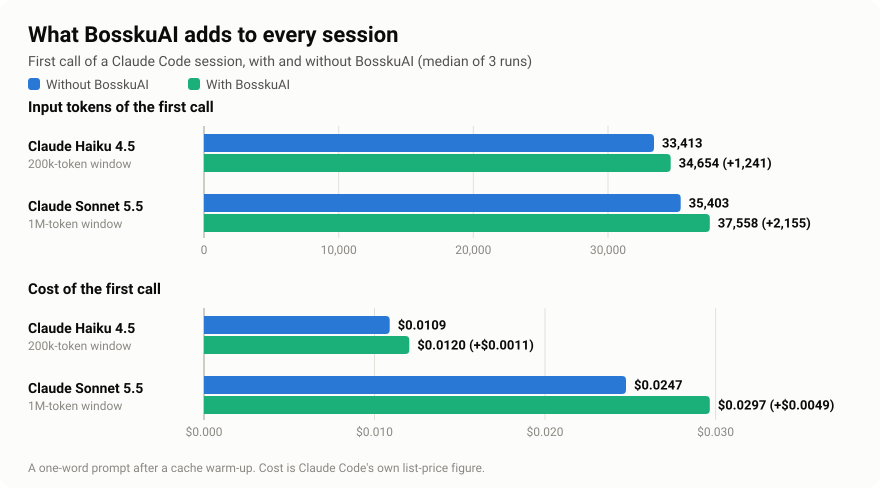
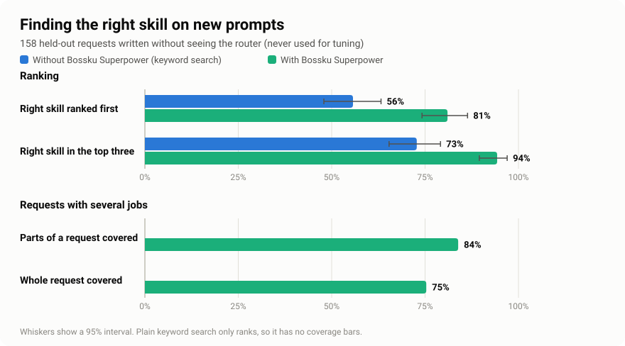
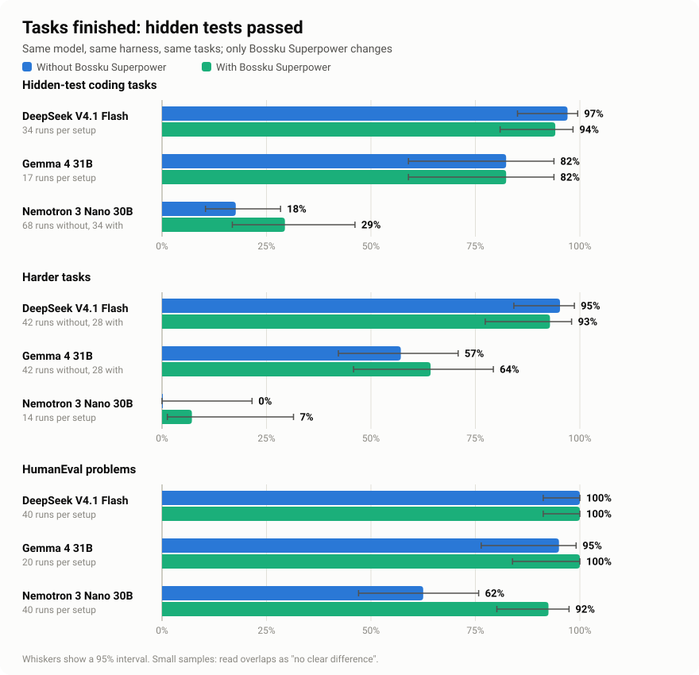
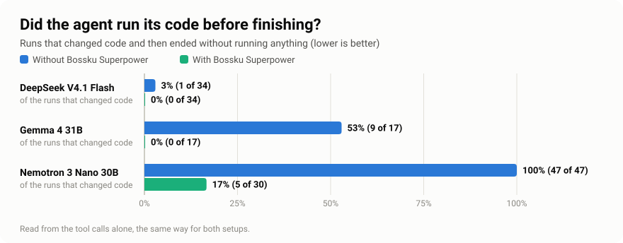
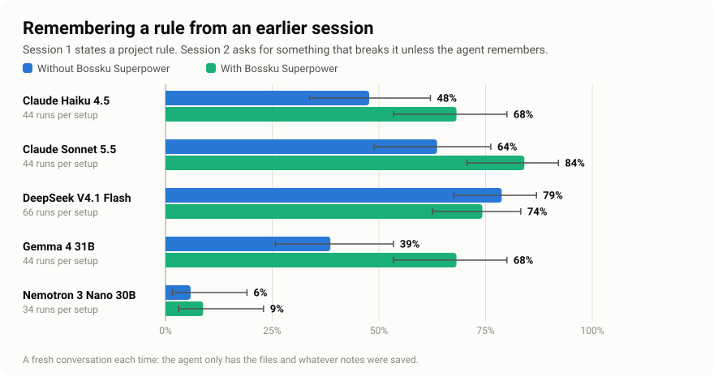
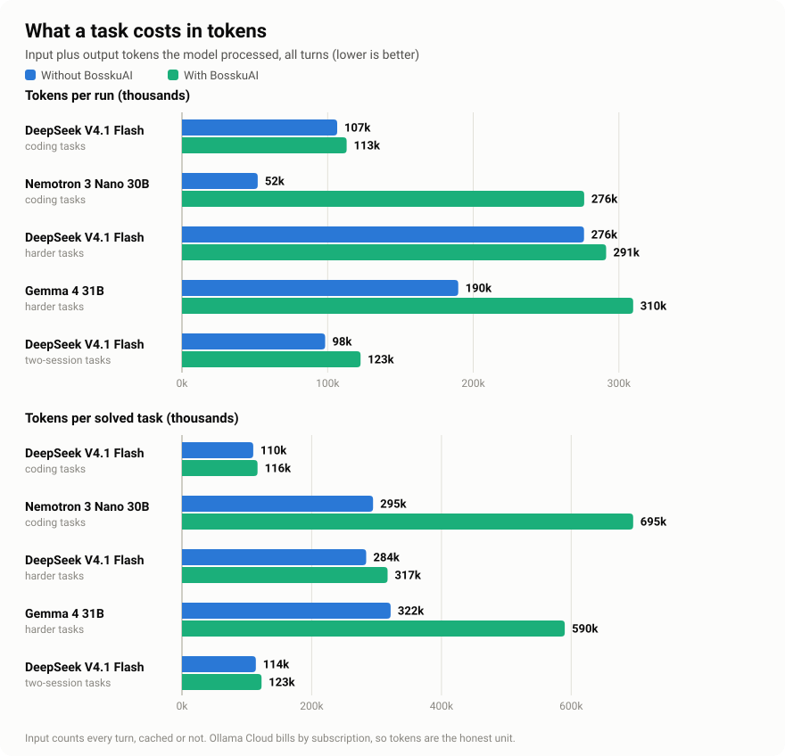

# BosskuAI

Skills for your coding agent, plus three habits that make its work better: find the right skill, run the code it writes, and remember your project.

Works with **Claude Code, Cursor, Codex, OpenCode, and OMP**. Free and open source ([MIT](LICENSE)).


## What you get

- **The right skill, found for you.** Say what you want in plain words. BosskuAI points your agent to the best skill, and adds a second one only when your request has two separate jobs.
- **Code that gets run.** If your agent changes code and never runs it, or pastes code into the chat instead of writing the file, it is sent back once. (Claude Code.)
- **A project that remembers.** Decisions, rules and lessons are saved as short notes, in Obsidian if you use it. The newest ones appear when the next session starts.
- **Light on your agent's context.** About 25 skills are listed each session, each with a short checklist. About 210 more are one command away.

For example:

```text
bossku, review this code for security problems.
```

## Does it help? We measured it with real agents

We ran a real coding agent (Claude Code) on coding tasks with hidden tests, once **without BosskuAI** and once **with BosskuAI**, on the same tasks, at the same time. Some tasks have two sessions: the first states a project rule, the second asks for related work that breaks the rule unless it is remembered. Every number, chart, and explanation below is rebuilt from result files saved in this repository, and a test fails if they ever disagree. How each check works, and what it cannot show, is in the [benchmark notes](docs/benchmarks/README.md).


### In short

In plain words: BosskuAI helps a model that skips checking its own work. A model that already checks its work passes about as often with or without it, and uses more tokens. Whether notes help a project keep its rules from one session to the next is shown further down.

<!-- summary-overall:start -->
- **DeepSeek V4.1 Flash gained nothing it could measure on coding tasks:** 97% without, 97% with.
- **Nemotron 3 Nano 30B finished more coding tasks with BosskuAI:** 18% without, 40% with.
- **DeepSeek V4.1 Flash gained nothing it could measure on harder tasks:** 97% without, 92% with.
- **Gemma 4 31B gained nothing it could measure on harder tasks:** 59% without, 52% with.
- **DeepSeek V4.1 Flash gained nothing it could measure on tasks that need a rule from an earlier session:** 86% without, 100% with.
- **The extra checking costs tokens:** tokens per run with BosskuAI compared with without: DeepSeek V4.1 Flash 1.1× on coding tasks, Nemotron 3 Nano 30B 5.3× on coding tasks, DeepSeek V4.1 Flash 1.1× on harder tasks, Gemma 4 31B 1.6× on harder tasks, DeepSeek V4.1 Flash 1.2× on two-session tasks.
- **It finds the right skill more often:** 75% first-pick accuracy on new requests, against 60% for keyword search.
- **Its fixed cost is small:** extra tokens on the first call of a session: 1,241 on Claude Haiku 4.5, 2,155 on Claude Sonnet 5.5.
<!-- summary-overall:end -->

### What it adds to every session



<!-- summary-overhead:start -->
**What this shows:** BosskuAI adds a small, fixed amount to the first call of a session: Claude Haiku 4.5 +1,241 tokens (4% more), +$0.0011; Claude Sonnet 5.5 +2,155 tokens (6% more), +$0.0049. That is the skill list and the short instructions. The same text is reused on every later call, so it does not grow with the length of the session.
<!-- summary-overhead:end -->

### Finding the right skill



<!-- summary-routing:start -->
**What this shows:** on 73 requests it was never tuned on, BosskuAI ranked an acceptable skill first 75% of the time, against 60% for plain keyword search. For requests with several jobs it found a fitting skill for every part 58% of the time. With a real agent (DeepSeek V4.1 Flash) on the same requests, an acceptable skill was actually opened for 55% of them.
<!-- summary-routing:end -->

### Finishing tasks



<!-- summary-pass:start -->
**Hidden-test coding tasks**
- **DeepSeek V4.1 Flash: no clear difference.** 97% with BosskuAI against 97% without (34 runs each): the same result on every one of the 17 tasks. Both setups were already near the ceiling, so there was little room to improve.
- **Nemotron 3 Nano 30B finished more tasks.** 40% with BosskuAI against 18% without (68 runs each): +22 points over the same tasks, 95% interval +12 to +34.

**Harder tasks**
- **DeepSeek V4.1 Flash: no clear difference.** 92% with BosskuAI against 97% without (36 runs each): -4 points over the same tasks, 95% interval -11 to 0. Both setups were already near the ceiling, so there was little room to improve.
- **Gemma 4 31B: no clear difference.** 52% with BosskuAI against 59% without (39 runs each): -6 points over the same tasks, 95% interval -15 to +5.
- 16 runs (7 with BosskuAI, 9 without) were cut short by a usage limit on the model account, so they count as neither passes nor failures and are left out.

**HumanEval problems**
- **DeepSeek V4.1 Flash: no clear difference.** 100% with BosskuAI against 100% without (38 runs each): the same result on every one of the 38 problems. Both setups were already near the ceiling, so there was little room to improve.
- **Nemotron 3 Nano 30B finished more problems.** 87% with BosskuAI against 60% without (35 runs each): +35 points over the same problems, 95% interval +12 to +54.
- 15 runs (9 with BosskuAI, 6 without) were cut short by a usage limit on the model account, so they count as neither passes nor failures and are left out.
<!-- summary-pass:end -->

### Running the code



<!-- summary-checking:start -->
**What this shows:** the habit that BosskuAI's stop check is built to change. A model that never runs what it wrote cannot find its own mistakes.
- **DeepSeek V4.1 Flash** ended without running its code in 3% of the runs that changed code on its own, and in 0% with BosskuAI.
- **Nemotron 3 Nano 30B** ended without running its code in 100% of the runs that changed code on its own, and in 33% with BosskuAI.
<!-- summary-checking:end -->

### Remembering a rule from an earlier session



<!-- summary-memory:start -->
**What this shows:** each task states a project rule in a first session (for example "this must run on Python 3.8" or "never use eval") and asks for related work in a second one that would break the rule if forgotten. The agent starts the second session fresh: without BosskuAI it has only the files; with BosskuAI it also sees the notes it saved.
- **DeepSeek V4.1 Flash: no clear difference.** 100% with BosskuAI against 86% without (22 runs each): +13 points over the same tasks, 95% interval 0 to +33. In the first session, the agent with BosskuAI saved the rule as a note 100% of the time.
- 11 runs (5 with BosskuAI, 6 without) were cut short by a usage limit on the model account, so they count as neither passes nor failures and are left out.
<!-- summary-memory:end -->

### What it costs in tokens



<!-- summary-effort:start -->
**What this shows:** BosskuAI makes the agent do more work, and work costs tokens. The extra work is running, checking and fixing. Where that turns failures into passes it is worth it; where the model already passes, it is not.
- **DeepSeek V4.1 Flash, coding tasks:** 1.1× the tokens per run (107k without, 113k with) and 1.1× the tokens per task it actually solved. It ran shell commands 3.0 times per run instead of 2.4.
- **Nemotron 3 Nano 30B, coding tasks:** 5.3× the tokens per run (52k without, 276k with) and 2.4× the tokens per task it actually solved. It ran shell commands 3.6 times per run instead of 0.1.
- **DeepSeek V4.1 Flash, harder tasks:** 1.1× the tokens per run (276k without, 291k with) and 1.1× the tokens per task it actually solved. It ran shell commands 5.1 times per run instead of 5.4.
- **Gemma 4 31B, harder tasks:** 1.6× the tokens per run (190k without, 310k with) and 1.8× the tokens per task it actually solved. It ran shell commands 6.2 times per run instead of 2.8.
- **DeepSeek V4.1 Flash, two-session tasks:** 1.2× the tokens per run (98k without, 123k with) and 1.1× the tokens per task it actually solved. It ran shell commands 2.1 times per run instead of 1.6.
<!-- summary-effort:end -->

### All the numbers

<!-- results:start -->
| First call of a session | Without BosskuAI | With BosskuAI |
|---|---:|---:|
| Claude Haiku 4.5: input tokens | 33,413 | 34,654 |
| Claude Haiku 4.5: cost | $0.0109 | $0.0120 |
| Claude Sonnet 5.5: input tokens | 35,403 | 37,558 |
| Claude Sonnet 5.5: cost | $0.0247 | $0.0297 |

| Finding a skill (73 new requests) | Keyword search only | With BosskuAI |
|---|---:|---:|
| Right skill ranked first | 60% | 75% |
| Right skill in the top three | 77% | 92% |
| Every part of a multi-part request covered | - | 58% |
| A real agent (DeepSeek V4.1 Flash) opens an acceptable skill | - | 55% |

| Hidden-test coding tasks | Without BosskuAI | With BosskuAI |
|---|---:|---:|
| DeepSeek V4.1 Flash: tasks passed (34 runs each) | 97% (33/34) | 97% (33/34) |
| DeepSeek V4.1 Flash: tokens per run | 107k | 113k |
| DeepSeek V4.1 Flash: ended without running its code | 3% | 0% |
| Nemotron 3 Nano 30B: tasks passed (68 runs each) | 18% (12/68) | 40% (27/68) |
| Nemotron 3 Nano 30B: tokens per run | 52k | 276k |
| Nemotron 3 Nano 30B: ended without running its code | 100% | 33% |

| Harder tasks | Without BosskuAI | With BosskuAI |
|---|---:|---:|
| DeepSeek V4.1 Flash: tasks passed (36 runs each) | 97% (35/36) | 92% (34/37) |
| DeepSeek V4.1 Flash: tokens per run | 276k | 291k |
| Gemma 4 31B: tasks passed (39 runs each) | 59% (23/39) | 52% (21/40) |
| Gemma 4 31B: tokens per run | 190k | 310k |

| HumanEval problems | Without BosskuAI | With BosskuAI |
|---|---:|---:|
| DeepSeek V4.1 Flash: tasks passed (38 runs each) | 100% (38/38) | 100% (40/40) |
| DeepSeek V4.1 Flash: tokens per run | 63k | 90k |
| Nemotron 3 Nano 30B: tasks passed (35 runs each) | 60% (21/35) | 87% (27/31) |
| Nemotron 3 Nano 30B: tokens per run | 87k | 212k |

| Remembering a rule from an earlier session | Without BosskuAI | With BosskuAI |
|---|---:|---:|
| DeepSeek V4.1 Flash: tasks passed (22 runs each) | 86% (19/22) | 100% (19/19) |
| DeepSeek V4.1 Flash: tokens per run | 98k | 123k |
<!-- results:end -->

### What these results do not show

- **Python projects of a few dozen to a few hundred lines.** Nothing here covers large repositories, other languages, or open-ended design work.
- **Three open models, not Claude.** The coding runs used a small, a mid-size and a strong open model through Ollama Cloud, driven by Claude Code. Claude models were measured only for the cost of a session's first call, so no dollar cost per coding task is reported; tokens are the unit.
- **Tasks written by assistants.** The harder and two-session tasks were written by AI assistants told not to read BosskuAI. Each was checked against a reference solution, and a few over-strict checks were fixed for both setups after a trial run. The [benchmark notes](docs/benchmarks/README.md) list what changed.
- **Small samples.** Overlapping intervals mean "no clear difference", not "equal".
- **One author's judgment.** The skill-search requests and the skills accepted for them were written by one person who had not seen the router.
- **Claude Code only.** The helper hooks exist for Claude Code. Cursor, Codex, OpenCode, and OMP get the skills and instructions but were not benchmarked.

## Install and start

Needs **Python 3.11+** and **Git**.

```bash
git clone https://github.com/wankimmy/Bossku-AI bosskuAI
cd bosskuAI
pip install -e .
bossku install --vault "/path/to/your/Obsidian/Vault" --memory-storage obsidian
cd /path/to/your/project
bossku init .
bossku doctor --project .
```

Open that project in your coding agent and say `bossku`.

- **No Obsidian?** Leave out `--vault` and `--memory-storage`. Notes then stay in `.bossku/memory` inside the project.
- **Want every skill listed?** The default is `--profile lean` (about 25 listed, the rest one command away). `--profile core` is a small set, and `--profile full` lists all ~235. See [installation](docs/installation.md#user-level-skills-once-per-machine).
- **Helper hooks.** Installing also adds small hooks for Claude Code: one names skills for your prompt, one makes the agent run its code, and one shows saved notes at the start. Turn off the run-your-code check with `BOSSKU_VERIFY_GATE=0`. Remove every hook with `bossku hooks uninstall`. Codex asks you to approve hooks once.
- **Another tool?** Follow the [Claude Code](docs/installation.md#claude-code), [Cursor](docs/installation.md#cursor), or [Codex](docs/installation.md#codex) steps. [OpenCode](docs/installation.md#opencode) and [OMP](docs/installation.md#omp) use skills and project files. For shared or cloud workspaces, see [portable mode](docs/installation.md#portable-mode-cloudshared-repos).

## See why a skill was chosen

```bash
bossku skills find "Review this code for security problems"
```

The answer names the main skill and any extra skills, says when a match is weak, and shows what was left out and why. Some skills can only be started by you (for example `/prototype`); BosskuAI says so instead of loading them.

## Keep project notes in one place

The agent saves a note when it learns something a future session needs: a decision and why, a plan, a fact, a lesson. Small fixes usually save nothing. The agent is told never to save secrets, prompts, or transcripts, and obvious secrets are blanked out before anything is written.

```bash
bossku memory-brief --project .       # the newest notes
bossku remember --project . --kind decision "Use the existing test runner for this project."
```

With Obsidian, the vault is the one place notes live. If the vault is missing, BosskuAI tells you the note was not saved; it does not quietly write into your repository. See [memory and Obsidian](docs/memory.md).

## Update

```bash
git pull
bossku update
bossku doctor
```

`bossku update` refreshes the installed skills and keeps your profile and your other skills.

## Check the repository

```bash
python -m bossku validate --root .
python -m unittest discover -s tests -v
```

After you change a skill description, rebuild the index first: `python -m bossku skills index --root .`

## More commands

| Command | What it does |
|---|---|
| `bossku init <project>` | Add project instructions and set up notes |
| `bossku init <project> --portable` | Put the skills inside the project |
| `bossku skills show <id>` | Print one skill (works for skills not in the agent's list) |
| `bossku skills audit` | Check skill size, descriptions, and links |
| `bossku hooks install` / `uninstall` | Add or remove the helper hooks |
| `bossku doctor --project .` | Check installed skills and project files |

## Explore the library

- [Skills](skills/) cover engineering, product, design, security, marketing, and founder work.
- [Shared instructions](AGENTS.md) keep the workflow the same across coding tools.
- [Benchmarks](docs/benchmarks/README.md) explain how every number above was measured and how to repeat it.
- [Third-party packs and credits](docs/third-party.md) list the vendored sources. [Optional requirements](requirements-optional.txt) cover separate tools.
- [Claude Code practice review](docs/claude-practices-review.md) and [Archify practice review](docs/archify-practices-review.md) explain how their advice was applied.

## License

[MIT](LICENSE).
