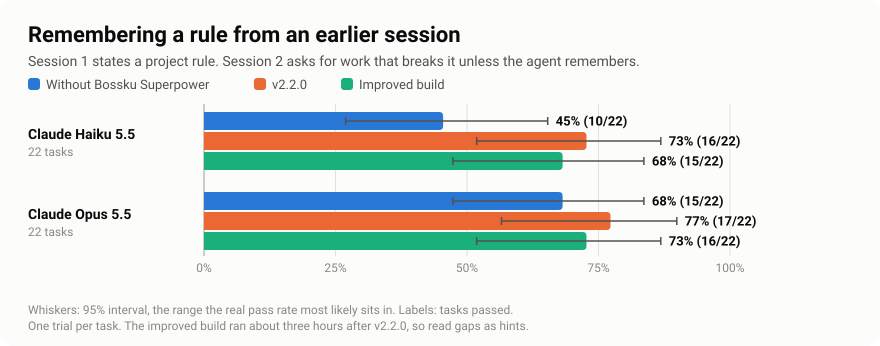
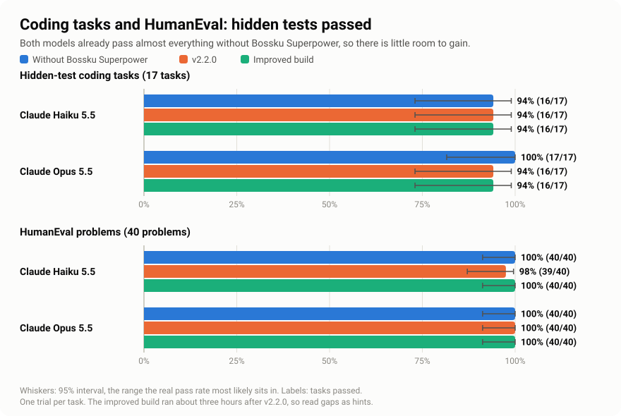
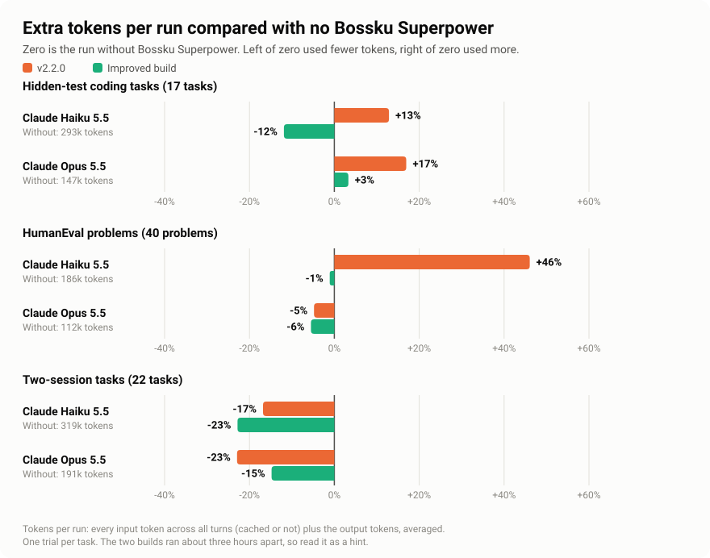

# Benchmark results: 10 October 2026

This is a second set of runs with real agents. It tests two builds of Bossku Superpower against no Bossku Superpower at all. The two builds are the v2.2.0 release and the improved build that came after it. Two Claude models ran everything. Four Ollama Cloud models were also started, but they mostly did not run. This set sits next to the [1 to 8 October set](results.md), which is unchanged. The method and the honesty rules are in the [benchmark notes](README.md).

The tables and the three charts are rebuilt from the saved summary [`benchmarks/results/2026-10-10.json`](../../benchmarks/results/2026-10-10.json) by [`scripts/summarize_run_set.py`](../../scripts/summarize_run_set.py). That summary is recomputed from the raw rows in [`benchmarks/results/raw/2026-10-10/`](../../benchmarks/results/raw/2026-10-10/). [`tests/test_results_2026_10_10.py`](../../tests/test_results_2026_10_10.py) fails if any of them has drifted. The sentences around the tables and charts are written by hand. Every number in them is read off a table, the summary, the raw rows, or a commit message or file that is cited where the number appears.

## The short answer

- **What helped: remembering a rule from an earlier session.** Session 1 sets a project rule. Session 2 asks for work that breaks the rule unless the agent remembers it. Claude Haiku 5.5 passed 10 of 22 such tasks without Bossku Superpower, 16 with v2.2.0 and 15 with the improved build. The v2.2.0 gain is +27 points (a point here is one percentage point: 50% to 60% is +10 points). Its 95% interval is +9 to +45. That is the range the real value most likely sits in, and it is above zero, so luck alone is unlikely to explain the gain. The improved build's gain is +23 points, but its interval reaches zero (0 to +45), so we are less sure. Claude Opus 5.5 passed 15, 17 and 16, and its intervals include zero, so we cannot say Opus gained.
- **What did not help: coding tasks and HumanEval.** Both Claude models already pass nearly everything without Bossku Superpower: Haiku 16 of 17 coding tasks and 40 of 40 HumanEval problems, Opus 17 of 17 and 40 of 40. They stayed there with either build. There was little room to gain.
- **The improved build is not clearly better than v2.2.0 on passes.** No change in pass rate is clearly different from zero. The improved build used fewer tokens per run in seven of the eight Claude cells (two models, four suites). The two builds ran about three hours apart, with one trial per task, so this set cannot say how much of that is the code change and how much is run-to-run noise.
- **What it costs: fewer tokens did not always mean a lower cost.** Tokens are the pieces of text the model reads and writes. Cost depends on the mix of tokens as well as the total. Haiku on the coding tasks with the improved build used 12% fewer tokens than without Bossku Superpower (258k against 293k) but cost more ($0.297 against $0.259). v2.2.0 used more tokens and cost more there (Haiku $0.259 to $0.347, Opus $0.151 to $0.190). On the 22 two-session tasks both builds used fewer tokens, and the three setups cost within a few cents of each other per run. Cost is Claude Code's own figure.
- **How sure we are: not very.** Each task ran once per setup, with 10 to 40 tasks per Claude cell (6 to 8 runs in the Ollama cells that ran), so one task is 6 points on the coding tasks. The four Ollama Cloud models mostly did not run: the account hit its usage limit part-way, and some runs failed during setup. No Ollama model has a scored coding-task or HumanEval run, and nothing is estimated for the empty cells. See "The Ollama coverage gap".

## The charts

The charts are plain images, so the tables further down are the place to read exact numbers. In every chart the colours keep the same meaning: blue is without Bossku Superpower, orange is v2.2.0 and green is the improved build.

### Remembering a rule from an earlier session



**What this shows.** Haiku remembered the rule in 10 of 22 tasks without Bossku Superpower, in 16 with v2.2.0 and in 15 with the improved build. The v2.2.0 gain (+27 points, 95% interval +9 to +45) is big enough that luck alone is unlikely to explain it. The improved build's gain is about the same size, but its interval reaches zero (+23 points, 0 to +45). Opus passed 15, 17 and 16 of 22. It already passed 15 without Bossku Superpower, which leaves less room to gain than Haiku's 10 of 22, and its gain intervals include zero. The whiskers are the 95% intervals. They are long because 22 tasks is a small sample. Haiku's Without and v2.2.0 whiskers overlap, but that does not mean there is no gain. The gain interval compares the same tasks one by one, which is more precise than comparing whiskers. It is in the first table of the "Remembering a rule from an earlier session" section below.

### Coding tasks and HumanEval



**What this shows.** Almost every bar is at or near the top (94% to 100%). When a model already passes nearly everything, a tool has little room to show a gain. Haiku passed 16 of 17 coding tasks in all three setups. On HumanEval it passed 40 of 40 without Bossku Superpower and with the improved build, and 39 of 40 with v2.2.0 (one problem). Opus passed 17 of 17 coding tasks without Bossku Superpower and 16 of 17 with either build (one task), and 40 of 40 HumanEval problems in every setup. One task of 17 is 6 points.

### Extra tokens per run



**What this shows.** Each bar is the change in tokens per run against the run without Bossku Superpower. Right of zero is more tokens, left of zero is fewer. It depends on the suite. On the coding tasks and HumanEval, v2.2.0 mostly used more (Haiku +13% and +46%, Opus +17%; Opus on HumanEval used 5% fewer). On the 22 two-session tasks, both builds used fewer tokens (15% to 23% fewer). The improved build used fewer tokens than v2.2.0 in five of these six cells; Opus on the two-session tasks is the exception. This chart is tokens, not money. A lower total did not always mean a lower cost. For example, Haiku on the coding tasks with the improved build used 12% fewer tokens than without Bossku Superpower, but it wrote more new text to the cache (about 15k tokens per run against 12k) and produced more output (about 6.4k against 5.4k), and the cost was higher ($0.297 against $0.259). The cache is a short-term store of text the model has already read. Cost per run is in the tables below. Read the chart as a hint only. Each task ran once, and the two builds ran about three hours apart.

## What was run

- **Models.** Claude Haiku 5.5 (`claude-haiku-5-5`) and Claude Opus 5.5 (`claude-opus-5-5`), on the author's own Claude login. DeepSeek V4.1 Flash, GLM 5.3 Flash, GLM 5.3 and Kimi K3, reached through Ollama Cloud's Anthropic-compatible API. The agent is Claude Code in headless mode (it runs from a script, with nobody at the keyboard) for all six.
- **Setups.** Three. A setup is one way of running the agent. The names in the data rows are `baseline`, `ship` and `ship2`.

| On this page | In the rows | Build |
|---|---|---|
| Without | `baseline` | No skills, hooks or instructions from Bossku Superpower. |
| v2.2.0 | `ship` | Commit `acf4fb3`. That is the v2.2.0 release (`037c4b1`) plus changes to the benchmark tool only (`git diff --stat 037c4b1 acf4fb3` lists `scripts/benchmark_agent.py` and `tests/test_bench_fixes.py`). It was meant to be the `+harness` arm (commit `acf4fb3`), which adds the Node hooks and deny rules that a 2.2 install ships. Deny rules are rules that block certain commands. The rows record the `lean` profile only. The arm flags are not in the rows, so which flags were on is unverified. One weak sign that the deny rules were on: the `denials` field is above zero in only 3 task rows, all on coding task `sec-02` and all in `ship` or `ship2` rows (2 and 1), none in a `baseline` row. |
| Improved build | `ship2` | Commit `cd73169`: v2.2.0 plus two commits, `afda557` and `cd73169` (`git log 037c4b1..cd73169` lists those two and `acf4fb3`). The rows record the `lean` profile as well. |

- **Suites and trials.** The same task sets as the 1 to 8 October set (the task ids match). A trial is one run of one task. There is one trial per task and setup: every scored row has `trial` 1.

| Suite (file prefix) | What it is | Tasks |
|---|---|---|
| `test` | Hidden-test coding tasks, `benchmarks/tasks/test` | 17 |
| `humaneval` | HumanEval problems | 40 |
| `memory` | The original two-session tasks, `benchmarks/tasks/memory` | 10 |
| `memory-rules` | The added two-session tasks, `benchmarks/tasks/memory-rules` | 12 |

- **Dates and times.** All times are UTC and come from the `timestamp` of each row. The author's local time is UTC+8. Without and v2.2.0 ran together for each model, in shuffled order. The improved build ran afterwards, between 2 h 40 min and 2 h 51 min after the v2.2.0 runs of the same model finished.

<!-- set-when:start -->
| Model | Setup | Task rows (scored or excluded) | First row (UTC) | Last row (UTC) | Claude Code version |
|---|---|---:|---|---|---|
| Claude Haiku 5.5 | Without | 79 | 2026-10-09 21:28 | 2026-10-09 21:52 | 2.1.281 |
| Claude Haiku 5.5 | v2.2.0 | 79 | 2026-10-09 21:28 | 2026-10-09 21:52 | 2.1.281 |
| Claude Haiku 5.5 | Improved build | 79 | 2026-10-10 00:42 | 2026-10-10 00:54 | 2.1.281 |
| Claude Opus 5.5 | Without | 79 | 2026-10-09 21:53 | 2026-10-09 22:15 | 2.1.281 |
| Claude Opus 5.5 | v2.2.0 | 79 | 2026-10-09 21:53 | 2026-10-09 22:15 | 2.1.281 |
| Claude Opus 5.5 | Improved build | 79 | 2026-10-10 00:55 | 2026-10-10 01:07 | 2.1.281 |
| DeepSeek V4.1 Flash | v2.2.0 | 32 | 2026-10-09 21:29 | 2026-10-09 23:29 | 2.1.281 |
| GLM 5.3 | Without | 30 | 2026-10-09 21:30 | 2026-10-10 00:13 | 2.1.281 |
| GLM 5.3 | v2.2.0 | 30 | 2026-10-09 21:30 | 2026-10-10 00:13 | 2.1.281 |
| GLM 5.3 Flash | Without | 30 | 2026-10-09 21:30 | 2026-10-10 00:14 | 2.1.281 |
| GLM 5.3 Flash | v2.2.0 | 30 | 2026-10-09 21:30 | 2026-10-10 00:13 | 2.1.281 |
| Kimi K3 | Without | 30 | 2026-10-09 21:31 | 2026-10-10 00:14 | 2.1.281 |
| Kimi K3 | v2.2.0 | 30 | 2026-10-09 21:30 | 2026-10-10 00:14 | 2.1.281 |
<!-- set-when:end -->

- **Cut-off.** The rows were copied on 10 October at 09:08 local time (01:08 UTC) from the git-ignored `benchmarks/results/latest/` folders. Nothing written after that is in this set. Rows added to those folders later are not part of it.
- **Claude Code version.** It is the last column above, read from the rows: 2.1.281 in every row where Claude Code started (the 102 harness-error rows have none, see "The Ollama coverage gap"). The 1 to 8 October set used 2.1.284 and 2.1.293.
- **Isolation.** Every run starts Claude Code with `--setting-sources project` (`agent_command` in [`scripts/benchmark_agent.py`](../../scripts/benchmark_agent.py)). So it reads only the settings of the run's own throwaway project folder, not the author's user or local settings. The rest of the isolation (a throwaway home, `CLAUDE.md` files switched off, instructions passed as a separate file) is described under "Rules that keep it honest" in the [benchmark notes](README.md). So is the canary: a check that the Without setup was given nothing, so it must answer `NONE`. In this set the canary answered `NONE` in all 11 files where it got an answer. In the other 9 files (all Ollama) it ended in the 429 error and nothing in those files was scored. The 4 DeepSeek V4.1 Flash files have no canary row, because DeepSeek ran no baseline here.
- **Reused baselines.** The Without setup does not depend on the Bossku Superpower build, so it was not run again in two places. First, the improved build was compared with the Without runs made about three hours earlier. Second, DeepSeek V4.1 Flash ran only the v2.2.0 setup here, so its Without figures are `baseline` rows from the 1 to 8 October set, limited to the tasks that have a scored v2.2.0 run here:

<!-- set-reused:start -->
| Suite | Model | Taken from | Tasks | Runs | First row (UTC) | Last row (UTC) | Claude Code version |
|---|---|---|---:|---:|---|---|---|
| Remembering a rule: the 10 original two-session tasks | DeepSeek V4.1 Flash | `raw/memory-deepseek-v4.1-flash.jsonl` | 10 | 30 | 2026-10-01 15:26 | 2026-10-01 17:15 | 2.1.284 |
| Remembering a rule: the 12 added two-session tasks | DeepSeek V4.1 Flash | `raw/memory-deepseek-v4.1-flash.jsonl` | 6 | 18 | 2026-10-05 08:37 | 2026-10-05 09:49 | 2.1.284 |
| Remembering a rule: all 22 two-session tasks | DeepSeek V4.1 Flash | `raw/memory-deepseek-v4.1-flash.jsonl` | 16 | 48 | 2026-10-01 15:26 | 2026-10-05 09:49 | 2.1.284 |
<!-- set-reused:end -->

Those rows come from other days and an older Claude Code version, and they hold 3 runs per task where the new rows hold 1. The model service may also have changed. Treat the DeepSeek comparison as weaker than the others.

## How to read the tables

- **Pass rate** is the share of runs where every hidden test passed. The brackets show a 95% Wilson interval: the range the real pass rate most likely sits in.
- **Change against without** is the difference in pass rate over the tasks both setups ran, in percentage points (50% to 60% is +10 points). The brackets show a 95% bootstrap interval over tasks: the same kind of range, found by resampling the tasks. `0 (0 to 0)` means every task had the same result in both setups. It is not a precise estimate.
- **Tokens per run** is every input token the model processed across all turns (cached or not) plus the output tokens. **Tokens against without** is the ratio of the two means. 1.1× means about 10% more.
- **Cost per run** is Claude Code's own figure. It exists only for the Claude models.
- No run in the scored rows ended on a time limit or on the dollar cap (`timeouts` and `budget_stops` are 0 in every arm of the summary).

## Hidden-test coding tasks

<!-- set-test:start -->
| Model | Setup | Runs | Passed | Pass rate (95% interval) | Change against without, points (95% interval) | Tokens per run | Tokens against without | Turns per run | Cost per run |
|---|---|---:|---:|---:|---:|---:|---:|---:|---:|
| Claude Haiku 5.5 | Without | 17 | 16 | 94% (73% to 99%) | - | 293k | - | 7.4 | $0.259 |
| Claude Haiku 5.5 | v2.2.0 | 17 | 16 | 94% (73% to 99%) | 0 (0 to 0) | 331k | 1.1× | 8.9 | $0.347 |
| Claude Haiku 5.5 | Improved build | 17 | 16 | 94% (73% to 99%) | 0 (0 to 0) | 258k | 0.9× | 7.5 | $0.297 |
| Claude Opus 5.5 | Without | 17 | 17 | 100% (82% to 100%) | - | 147k | - | 4.4 | $0.151 |
| Claude Opus 5.5 | v2.2.0 | 17 | 16 | 94% (73% to 99%) | -6 (-18 to 0) | 172k | 1.2× | 4.9 | $0.190 |
| Claude Opus 5.5 | Improved build | 17 | 16 | 94% (73% to 99%) | -6 (-18 to 0) | 152k | 1.0× | 4.4 | $0.181 |
| DeepSeek V4.1 Flash | none scored | 0 | - | - | - | - | - | - | - |
| GLM 5.3 | none scored | 0 | - | - | - | - | - | - | - |
| GLM 5.3 Flash | none scored | 0 | - | - | - | - | - | - | - |
| Kimi K3 | none scored | 0 | - | - | - | - | - | - | - |
<!-- set-test:end -->

Both Claude models were at or near the ceiling in every setup. The one task difference for Opus (17 of 17 without, 16 of 17 with either build) is one task of 17.

## HumanEval problems

<!-- set-humaneval:start -->
| Model | Setup | Runs | Passed | Pass rate (95% interval) | Change against without, points (95% interval) | Tokens per run | Tokens against without | Turns per run | Cost per run |
|---|---|---:|---:|---:|---:|---:|---:|---:|---:|
| Claude Haiku 5.5 | Without | 40 | 40 | 100% (91% to 100%) | - | 186k | - | 5.1 | $0.117 |
| Claude Haiku 5.5 | v2.2.0 | 40 | 39 | 98% (87% to 100%) | -2 (-8 to 0) | 272k | 1.5× | 7.5 | $0.194 |
| Claude Haiku 5.5 | Improved build | 40 | 40 | 100% (91% to 100%) | 0 (0 to 0) | 184k | 1.0× | 5.7 | $0.155 |
| Claude Opus 5.5 | Without | 40 | 40 | 100% (91% to 100%) | - | 112k | - | 3.1 | $0.076 |
| Claude Opus 5.5 | v2.2.0 | 40 | 40 | 100% (91% to 100%) | 0 (0 to 0) | 106k | 1.0× | 3.0 | $0.091 |
| Claude Opus 5.5 | Improved build | 40 | 40 | 100% (91% to 100%) | 0 (0 to 0) | 105k | 0.9× | 3.0 | $0.091 |
| DeepSeek V4.1 Flash | none scored | 0 | - | - | - | - | - | - | - |
| GLM 5.3 | none scored | 0 | - | - | - | - | - | - | - |
| GLM 5.3 Flash | none scored | 0 | - | - | - | - | - | - | - |
| Kimi K3 | none scored | 0 | - | - | - | - | - | - | - |
<!-- set-humaneval:end -->

The same picture: at the ceiling. Among the Claude runs, only Haiku with v2.2.0 missed a problem (39 of 40). Every other setup passed all 40.

## Remembering a rule from an earlier session

Each task states a project rule in a first session. It then asks for related work in a second, fresh session that breaks the rule unless it is remembered. See "Remembering a rule from an earlier session" in the [benchmark notes](README.md). In the first session the agent saved the rule as a note in every scored run with either build (`saved_a_note_rate` is 1.0 in every v2.2.0 and improved cell of the summary, and 0.0 without).

All 22 tasks together, for each model that has scored runs in both sets:

<!-- set-memory-both:start -->
| Model | Setup | Runs | Passed | Pass rate (95% interval) | Change against without, points (95% interval) | Tokens per run | Tokens against without | Turns per run | Cost per run |
|---|---|---:|---:|---:|---:|---:|---:|---:|---:|
| Claude Haiku 5.5 | Without | 22 | 10 | 45% (27% to 65%) | - | 319k | - | 9.0 | $0.292 |
| Claude Haiku 5.5 | v2.2.0 | 22 | 16 | 73% (52% to 87%) | +27 (+9 to +45) | 265k | 0.8× | 8.6 | $0.316 |
| Claude Haiku 5.5 | Improved build | 22 | 15 | 68% (47% to 84%) | +23 (0 to +45) | 246k | 0.8× | 8.3 | $0.295 |
| Claude Opus 5.5 | Without | 22 | 15 | 68% (47% to 84%) | - | 191k | - | 5.2 | $0.179 |
| Claude Opus 5.5 | v2.2.0 | 22 | 17 | 77% (57% to 90%) | +9 (-9 to +27) | 147k | 0.8× | 4.1 | $0.176 |
| Claude Opus 5.5 | Improved build | 22 | 16 | 73% (52% to 87%) | +5 (-9 to +18) | 163k | 0.9× | 4.6 | $0.181 |
| DeepSeek V4.1 Flash | Without (reused 1-8 October runs) | 48 | 40 | 83% (70% to 91%) | - | 114k | - | 7.9 | - |
| DeepSeek V4.1 Flash | v2.2.0 | 16 | 14 | 88% (64% to 97%) | +4 (-15 to +25) | 120k | 1.1× | 8.1 | - |
<!-- set-memory-both:end -->

The 10 original tasks:

<!-- set-memory:start -->
| Model | Setup | Runs | Passed | Pass rate (95% interval) | Change against without, points (95% interval) | Tokens per run | Tokens against without | Turns per run | Cost per run |
|---|---|---:|---:|---:|---:|---:|---:|---:|---:|
| Claude Haiku 5.5 | Without | 10 | 5 | 50% (24% to 76%) | - | 286k | - | 8.0 | $0.288 |
| Claude Haiku 5.5 | v2.2.0 | 10 | 7 | 70% (40% to 89%) | +20 (0 to +50) | 286k | 1.0× | 8.4 | $0.329 |
| Claude Haiku 5.5 | Improved build | 10 | 7 | 70% (40% to 89%) | +20 (0 to +50) | 264k | 0.9× | 7.7 | $0.300 |
| Claude Opus 5.5 | Without | 10 | 8 | 80% (49% to 94%) | - | 178k | - | 5.1 | $0.169 |
| Claude Opus 5.5 | v2.2.0 | 10 | 9 | 90% (60% to 98%) | +10 (0 to +30) | 137k | 0.8× | 3.9 | $0.173 |
| Claude Opus 5.5 | Improved build | 10 | 8 | 80% (49% to 94%) | 0 (0 to 0) | 133k | 0.7× | 3.8 | $0.171 |
| DeepSeek V4.1 Flash | Without (reused 1-8 October runs) | 30 | 26 | 87% (70% to 95%) | - | 97k | - | 7.0 | - |
| DeepSeek V4.1 Flash | v2.2.0 | 10 | 9 | 90% (60% to 98%) | +3 (-27 to +33) | 113k | 1.2× | 7.5 | - |
| GLM 5.3 | Without | 8 | 7 | 88% (53% to 98%) | - | 102k | - | 7.2 | - |
| GLM 5.3 | v2.2.0 | 8 | 7 | 88% (53% to 98%) | 0 (0 to 0) | 116k | 1.1× | 7.9 | - |
| GLM 5.3 Flash | Without | 6 | 5 | 83% (44% to 97%) | - | 198k | - | 10.8 | - |
| GLM 5.3 Flash | v2.2.0 | 8 | 7 | 88% (53% to 98%) | 0 (0 to 0) | 114k | 0.6× | 7.8 | - |
| Kimi K3 | Without | 7 | 4 | 57% (25% to 84%) | - | 92k | - | 6.3 | - |
| Kimi K3 | v2.2.0 | 8 | 6 | 75% (41% to 93%) | +33 (0 to +67) | 105k | 1.1× | 7.8 | - |
<!-- set-memory:end -->

The 12 added tasks:

<!-- set-memory-rules:start -->
| Model | Setup | Runs | Passed | Pass rate (95% interval) | Change against without, points (95% interval) | Tokens per run | Tokens against without | Turns per run | Cost per run |
|---|---|---:|---:|---:|---:|---:|---:|---:|---:|
| Claude Haiku 5.5 | Without | 12 | 5 | 42% (19% to 68%) | - | 346k | - | 9.9 | $0.295 |
| Claude Haiku 5.5 | v2.2.0 | 12 | 9 | 75% (47% to 91%) | +33 (+8 to +58) | 248k | 0.7× | 8.8 | $0.305 |
| Claude Haiku 5.5 | Improved build | 12 | 8 | 67% (39% to 86%) | +25 (-8 to +58) | 231k | 0.7× | 8.8 | $0.290 |
| Claude Opus 5.5 | Without | 12 | 7 | 58% (32% to 81%) | - | 203k | - | 5.3 | $0.188 |
| Claude Opus 5.5 | v2.2.0 | 12 | 8 | 67% (39% to 86%) | +8 (-17 to +33) | 156k | 0.8× | 4.3 | $0.178 |
| Claude Opus 5.5 | Improved build | 12 | 8 | 67% (39% to 86%) | +8 (-17 to +33) | 188k | 0.9× | 5.3 | $0.189 |
| DeepSeek V4.1 Flash | Without (reused 1-8 October runs) | 18 | 14 | 78% (55% to 91%) | - | 143k | - | 9.3 | - |
| DeepSeek V4.1 Flash | v2.2.0 | 6 | 5 | 83% (44% to 97%) | +6 (-17 to +33) | 132k | 0.9× | 9.2 | - |
| GLM 5.3 | none scored | 0 | - | - | - | - | - | - | - |
| GLM 5.3 Flash | none scored | 0 | - | - | - | - | - | - | - |
| Kimi K3 | none scored | 0 | - | - | - | - | - | - | - |
<!-- set-memory-rules:end -->

For GLM 5.3, GLM 5.3 Flash and Kimi K3, only the 10 original tasks were scored. They have 6 to 8 runs per setup, and some tasks are missing from one setup (see "The Ollama coverage gap" below). DeepSeek V4.1 Flash has v2.2.0 runs only. None of the Ollama intervals lies wholly above or below zero (Kimi K3's starts at zero). So the Ollama rows do not show a clear gain or loss either way.

## Ended without running its code

Some runs change code through the edit tools and then end without running anything afterwards. This table counts them. It reads the tool calls alone, the same measure as in the [benchmark notes](README.md#numbers). The count is out of the runs that edited code that way. It is small in some Opus cells, so compare the counts, not the shares.

<!-- set-checking:start -->
| Suite | Model | Without | v2.2.0 | Improved build |
|---|---|---:|---:|---:|
| Hidden-test coding tasks | Claude Haiku 5.5 | 0 of 17 | 2 of 17 | 0 of 17 |
| Hidden-test coding tasks | Claude Opus 5.5 | 0 of 11 | 0 of 8 | 0 of 4 |
| HumanEval problems | Claude Haiku 5.5 | 0 of 40 | 0 of 39 | 0 of 40 |
| HumanEval problems | Claude Opus 5.5 | 0 of 4 | 0 of 0 | 0 of 0 |
| Remembering a rule: the 10 original two-session tasks | Claude Haiku 5.5 | 0 of 10 | 0 of 10 | 0 of 10 |
| Remembering a rule: the 10 original two-session tasks | Claude Opus 5.5 | 0 of 3 | 0 of 1 | 0 of 1 |
| Remembering a rule: the 10 original two-session tasks | DeepSeek V4.1 Flash | 0 of 30 | 0 of 10 | - |
| Remembering a rule: the 10 original two-session tasks | GLM 5.3 | 0 of 8 | 0 of 8 | - |
| Remembering a rule: the 10 original two-session tasks | GLM 5.3 Flash | 0 of 6 | 0 of 8 | - |
| Remembering a rule: the 10 original two-session tasks | Kimi K3 | 0 of 7 | 0 of 8 | - |
| Remembering a rule: the 12 added two-session tasks | Claude Haiku 5.5 | 0 of 12 | 0 of 12 | 0 of 12 |
| Remembering a rule: the 12 added two-session tasks | Claude Opus 5.5 | 0 of 3 | 0 of 1 | 0 of 3 |
| Remembering a rule: the 12 added two-session tasks | DeepSeek V4.1 Flash | 0 of 18 | 0 of 6 | - |
<!-- set-checking:end -->

Almost every count is 0. The one exception is Haiku on the coding tasks with v2.2.0: 2 of 17 ended without running its code, against 0 of 17 without Bossku Superpower and with the improved build.

## Improved build against v2.2.0

The same tasks, with the two builds run about three hours apart. Change is the improved build minus v2.2.0.

<!-- set-improved:start -->
| Suite | Model | Pass rate v2.2.0 | Pass rate improved | Change, points (95% interval) | Tokens per run v2.2.0 | Tokens per run improved | Turns per run v2.2.0 | Turns per run improved |
|---|---|---:|---:|---:|---:|---:|---:|---:|
| Hidden-test coding tasks | Claude Haiku 5.5 | 94% (16/17) | 94% (16/17) | 0 (0 to 0) | 331k | 258k | 8.9 | 7.5 |
| Hidden-test coding tasks | Claude Opus 5.5 | 94% (16/17) | 94% (16/17) | 0 (0 to 0) | 172k | 152k | 4.9 | 4.4 |
| HumanEval problems | Claude Haiku 5.5 | 98% (39/40) | 100% (40/40) | +2 (0 to +8) | 272k | 184k | 7.5 | 5.7 |
| HumanEval problems | Claude Opus 5.5 | 100% (40/40) | 100% (40/40) | 0 (0 to 0) | 106k | 105k | 3.0 | 3.0 |
| Remembering a rule: the 10 original two-session tasks | Claude Haiku 5.5 | 70% (7/10) | 70% (7/10) | 0 (0 to 0) | 286k | 264k | 8.4 | 7.7 |
| Remembering a rule: the 10 original two-session tasks | Claude Opus 5.5 | 90% (9/10) | 80% (8/10) | -10 (-30 to 0) | 137k | 133k | 3.9 | 3.8 |
| Remembering a rule: the 12 added two-session tasks | Claude Haiku 5.5 | 75% (9/12) | 67% (8/12) | -8 (-25 to 0) | 248k | 231k | 8.8 | 8.8 |
| Remembering a rule: the 12 added two-session tasks | Claude Opus 5.5 | 67% (8/12) | 67% (8/12) | 0 (-25 to +25) | 156k | 188k | 4.3 | 5.3 |
| Remembering a rule: all 22 two-session tasks | Claude Haiku 5.5 | 73% (16/22) | 68% (15/22) | -5 (-14 to 0) | 265k | 246k | 8.6 | 8.3 |
| Remembering a rule: all 22 two-session tasks | Claude Opus 5.5 | 77% (17/22) | 73% (16/22) | -5 (-18 to +9) | 147k | 163k | 4.1 | 4.6 |
<!-- set-improved:end -->

Pass rates did not change clearly in any row: every interval reaches zero. The two all-22 rows repeat the 10 and 12 task rows, so leave them out and eight rows are left (two models, four suites). The change is 0 points in five of those. In the other three the interval ends at zero (+2, -10 and -8 points). Tokens per run fell in 8 of the 10 rows and rose in 2 (Opus on the 12 added tasks, 156k to 188k, and on all 22). Leaving out the all-22 rows, that is fewer tokens in seven of the eight and more in one. See the third point of "The short answer".

## The Ollama coverage gap

The Ollama rows are partial. Two things left cells empty, and neither is a result about the models. What the rows show:

- The newest scored Ollama row finished at 21:45 UTC on 9 October. The first run to end with `API Error: Request rejected (429)` and a message that the account had reached its session usage limit finished at 22:02 UTC (it was tried three times, about 190 seconds in all). No Ollama row after that was scored (`ollama_limit` in the summary).
- A run that ends in an API error is an infrastructure failure. It is excluded and counted, and never scored. It does not count as a failed task.
- A second cause shows up in the 17-task coding suite for GLM 5.3, GLM 5.3 Flash and Kimi K3. All 34 runs of each ended as a harness error while the run folder was being set up: `RuntimeError: ['git', 'init', '-q']`, with no error text saved. They are excluded and counted too. Why `git init` failed is not recorded (unverified), and it is not a 429.
- After four infrastructure failures in a row the harness stops a suite. That is why some suites have only 3 to 5 attempted runs.

<!-- set-excluded:start -->
| Suite | Model | Excluded runs (setup, reason: count) | Of those, "Request rejected (429)" |
|---|---|---|---:|
| Hidden-test coding tasks | DeepSeek V4.1 Flash | v2.2.0, infrastructure failure: 5 | 5 |
| Hidden-test coding tasks | GLM 5.3 | Without, harness error: 17; v2.2.0, harness error: 17 | 0 |
| Hidden-test coding tasks | GLM 5.3 Flash | Without, harness error: 17; v2.2.0, harness error: 17 | 0 |
| Hidden-test coding tasks | Kimi K3 | Without, harness error: 17; v2.2.0, harness error: 17 | 0 |
| HumanEval problems | DeepSeek V4.1 Flash | v2.2.0, infrastructure failure: 5 | 5 |
| HumanEval problems | GLM 5.3 | Without, infrastructure failure: 2; v2.2.0, infrastructure failure: 1 | 3 |
| HumanEval problems | GLM 5.3 Flash | Without, infrastructure failure: 2; v2.2.0, infrastructure failure: 1 | 3 |
| HumanEval problems | Kimi K3 | Without, infrastructure failure: 2; v2.2.0, infrastructure failure: 1 | 3 |
| Remembering a rule: the 10 original two-session tasks | GLM 5.3 | Without, infrastructure failure: 2; v2.2.0, infrastructure failure: 2 | 4 |
| Remembering a rule: the 10 original two-session tasks | GLM 5.3 Flash | Without, infrastructure failure: 4; v2.2.0, infrastructure failure: 2 | 6 |
| Remembering a rule: the 10 original two-session tasks | Kimi K3 | Without, infrastructure failure: 3; v2.2.0, infrastructure failure: 2 | 5 |
| Remembering a rule: the 12 added two-session tasks | DeepSeek V4.1 Flash | v2.2.0, infrastructure failure: 6 | 6 |
| Remembering a rule: the 12 added two-session tasks | GLM 5.3 | Without, infrastructure failure: 1; v2.2.0, infrastructure failure: 2 | 3 |
| Remembering a rule: the 12 added two-session tasks | GLM 5.3 Flash | Without, infrastructure failure: 1; v2.2.0, infrastructure failure: 2 | 3 |
| Remembering a rule: the 12 added two-session tasks | Kimi K3 | Without, infrastructure failure: 1; v2.2.0, infrastructure failure: 2 | 3 |
| All | All | infrastructure failure: 49; harness error: 102 | 49 |
<!-- set-excluded:end -->

What is empty as a result: no Ollama model has a scored coding-task or HumanEval run. GLM 5.3, GLM 5.3 Flash and Kimi K3 have no scored run on the 12 added two-session tasks. DeepSeek V4.1 Flash has no scored run on the coding tasks or HumanEval, and 6 of the 12 added tasks. Nothing here is a statement about those models on those suites. To fill the cells, run the same suites again when the account allows (see the commands in the [benchmark notes](README.md#repeat-the-runs-spends-model-usage)). The results would be a later dated set.

## What changed between v2.2.0 and the improved build

Two commits, `afda557` and `cd73169`:

- **The stop gate counts running the code (`afda557`).** The stop gate (`hooks/stop-gate.mjs`, Node) is a check that runs when the agent is about to finish. It used to count only test runners, linters and builds as "the check". So an agent that wrote a small check script and ran it (`python check.py`, `python - <<EOF`, `python -c`, `node script.js`, `bash run.sh`) was sent back anyway. It now counts what the Python verify gate always counted (commit message): a script, `-c` or a heredoc fed to an interpreter, or a shell script, per command. Read-only commands (`grep`, `cat`), `--version`, `-h` and package installs do not count. The commit message reports, on the 9 dev tasks with Claude Haiku 5.5, the gate firing 2 times before and 0 after, and turns 80 before and 67 after. Those rows are not committed, so this page does not rely on them.
- **Clearer skill descriptions, friendlier CLI output, faster skill hint (`cd73169`).** 70 first-party skill descriptions now open with "Use when ...", so a model reading the skill list can pick better. On an interactive terminal the CLI prints a short summary. Piped output (what an agent sees) stays the same JSON. The skill hint is about 10 ms faster at the 95th percentile, with the same picks on 628 prompts (commit message). [`benchmarks/results/hint-tuning.json`](../../benchmarks/results/hint-tuning.json) (`hint_tuning.after_review.latency_after_revert`) has v1 at 33.5, 33.7 and 33.8 ms before and 24.0, 23.9 and 23.8 ms after. That was measured in-process on one machine, not in an agent run.
- **What the runs here can show.** By the commit messages, only the stop gate and the descriptions can change what an agent sees or is told. In the table above the improved build used fewer turns than v2.2.0 for Claude Haiku 5.5 on the coding tasks (8.9 to 7.5) and on HumanEval (7.5 to 5.7). Haiku also ended without running its code in 0 of 17 coding runs, against 2 of 17 with v2.2.0. That agrees with the reason for the stop-gate change. But it is one trial per task, two sessions of work apart, with no check of how often the gate fired. It is a hint, not a measured effect.

## Limits

- **Small samples, one trial.** 10 to 40 tasks per Claude cell (6 to 8 runs in the Ollama cells that ran) and one run per task and setup. A difference of one task is 6 points on the coding tasks, 10 points on the 10 original tasks and 8 on the 12 added ones. Intervals are wide: Haiku's 22-task gain with v2.2.0 spans +9 to +45 points, and with the improved build 0 to +45.
- **The builds ran in different sessions.** The improved build is compared with Without and v2.2.0 runs made about three hours earlier. The model service can be faster or slower from one hour to the next, and nothing here controls for that.
- **Not a re-run of the first set.** The task sets match the 1 to 8 October set, but the Claude models are different (Haiku 5.5 and Opus 5.5 here; Haiku 4.5 and Sonnet 5.5 there). The first set also measured commit `b8ccea1`. Compare directions, not numbers.
- **Ceiling effects.** On the coding tasks and HumanEval both Claude models pass nearly everything without Bossku Superpower, so there is little room to show a gain. Only the two-session tasks have room.
- **DeepSeek's baseline is borrowed** from other days and an older Claude Code version (see "Reused baselines").
- **Coverage.** The Ollama cells described above are empty, not estimated.
- **Cost is Claude Code's own figure** for the Claude models. It is not reported for the Ollama models.
- **Python tasks only**, from a few dozen to a few hundred lines. The same limits as in the [benchmark notes](README.md#limits) apply.

## Recompute every number

No model is needed. From the repository root:

```bash
python -m unittest tests.test_results_2026_10_10 -v     # summary, tables and charts match the raw rows, and the rows are scrubbed
python scripts/summarize_run_set.py 2026-10-10 --check  # the same check from the command line
python scripts/benchmark_agent.py report benchmarks/results/raw/2026-10-10/test-claude-haiku-5-5.jsonl
python scripts/benchmark_agent.py report benchmarks/results/raw/2026-10-10/memory-claude-haiku-5-5.jsonl \
    benchmarks/results/raw/2026-10-10/memory-rules-claude-haiku-5-5.jsonl     # the 22-task row of the pooled table
python scripts/summarize_run_set.py 2026-10-10          # rewrites the summary, the tables of this page and the three charts
git diff --stat 037c4b1 acf4fb3                         # v2.2.0 against the benchmarked commit
git log --oneline 037c4b1..cd73169                      # the two commits between v2.2.0 and the improved build
```

The raw files are named `<suite>-<model>.jsonl` (`test` is the coding suite; `memory-*` also matches `memory-rules-*`, so name the files). They hold one row per run, with free text cut to 240 characters and account names, folder names and request ids replaced by placeholders. The rows were made with `benchmark_agent.py compact --kind task --kind selftest` from the unscrubbed run folders under `benchmarks/results/latest/`, which Git ignores: `2026-10-10` and `2026-10-10-improve` for the Claude models (arms `baseline` and `ship` from the first, `ship2` from the second) and `2026-10-10` for the Ollama models.
